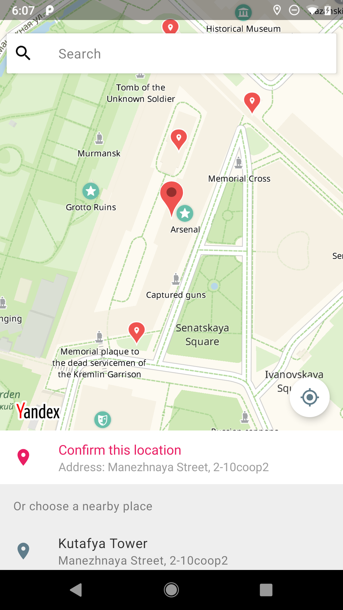
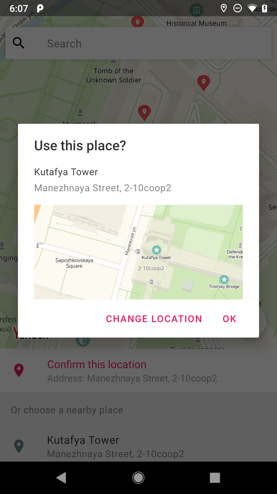
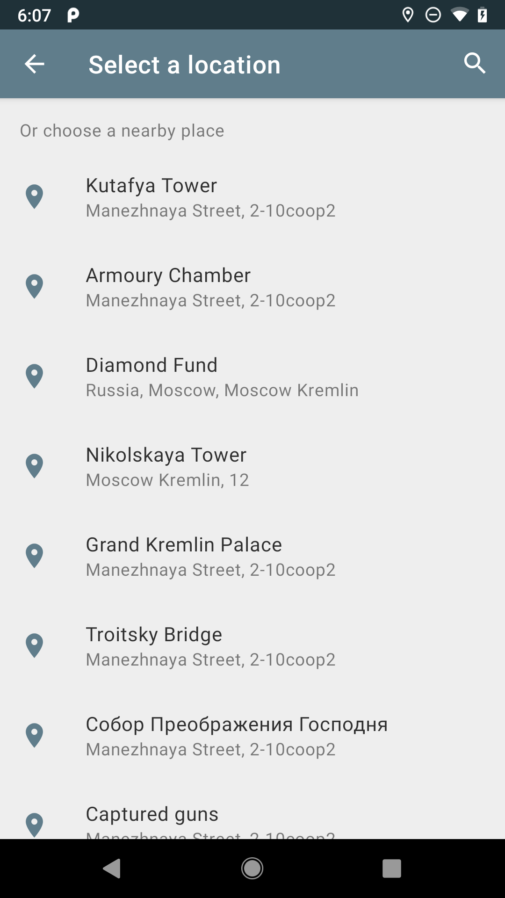
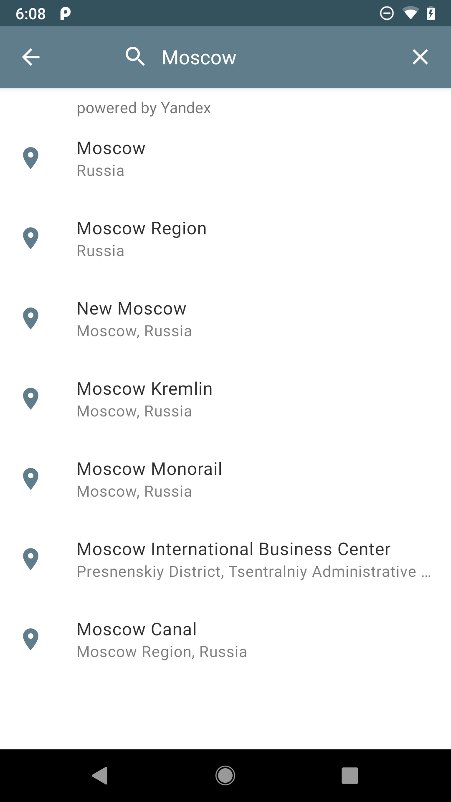

# Yandex Place Picker
[](https://jitpack.io/#vanyasem/YandexPlacePicker)

Google Maps SDK used to feature a Place Picker. It was deprecated and removed. There is a custom library called [PING](https://github.com/rtchagas/pingplacepicker) that implements similar functionality using the Geocoder API. **It's expensive.**

**Yandex Place Picker** is partially based on [PING](https://github.com/rtchagas/pingplacepicker), and provides you with the same functionality utilising Yandex MapKit. At no cost.

   

## A key difference

There is a capability to utilize icons, but Google's icon names differ from Yandex's (and there isn't a full list anywhere to find), which requires manual renaming of all the icons. A few of them (banks, for example) are included. Feel free to contribute with more icons.

## Download

Add Jitpack in your root build.gradle at the end of repositories:

	allprojects {
		repositories {
			...
			maven { url 'https://jitpack.io' }
		}
	}
  
Step 2. Add the dependency

	dependencies {
	        implementation 'com.github.vanyasem:YandexPlacePicker:1.0'
	}

 ## Hands on
 
Sign up for MapKit API keys - [How to](https://tech.yandex.com/maps/mapkit/doc/3.x/concepts/android/quickstart-docpage/#quickstart__key)

Check the [sample](https://github.com/vanyasem/YandexPlacePicker/tree/master/sample) project for a full working example.

### Java
```java
    private void showPlacePicker() {
        YandexPlacePicker.IntentBuilder builder = new YandexPlacePicker.IntentBuilder();
        builder.setYandexMapsKey("YOUR_MAPKIT_API_KEY");
        Intent placeIntent = builder.build(getActivity());
        startActivityForResult(placeIntent, REQUEST_PLACE_PICKER);
    }
    
    @Override  
    public void onActivityResult(int requestCode, int resultCode, Intent data) {  
        if ((requestCode == REQUEST_PLACE_PICKER)) {  
            if(data != null) {
                PlaceParcelable place = YandexPlacePicker.getPlace(data);
                Toast.makeText(this, "You selected: " + place.getName(), Toast.LENGTH_SHORT).show();
            }
        }
    }
```

## Configuration

You can alter the behavior of the picker by editing `config.xml`.

```xml  
<bool name="show_confirmation_dialog">true</bool>

<bool name="show_confirmation_buttons">false</bool>

<bool name="show_pins_on_map">true</bool>

<bool name="show_place_icons">true</bool>

<bool name="search_on_scroll">false</bool>

<integer name="default_zoom">17</integer>
```
 
## License

Copyright 2019 Ivan Semkin

Licensed under the Apache License, Version 2.0 (the "License");
you may not use this file except in compliance with the License.
You may obtain a copy of the License at

   http://www.apache.org/licenses/LICENSE-2.0

Unless required by applicable law or agreed to in writing, software
distributed under the License is distributed on an "AS IS" BASIS,
WITHOUT WARRANTIES OR CONDITIONS OF ANY KIND, either express or implied.
See the License for the specific language governing permissions and
limitations under the License.
